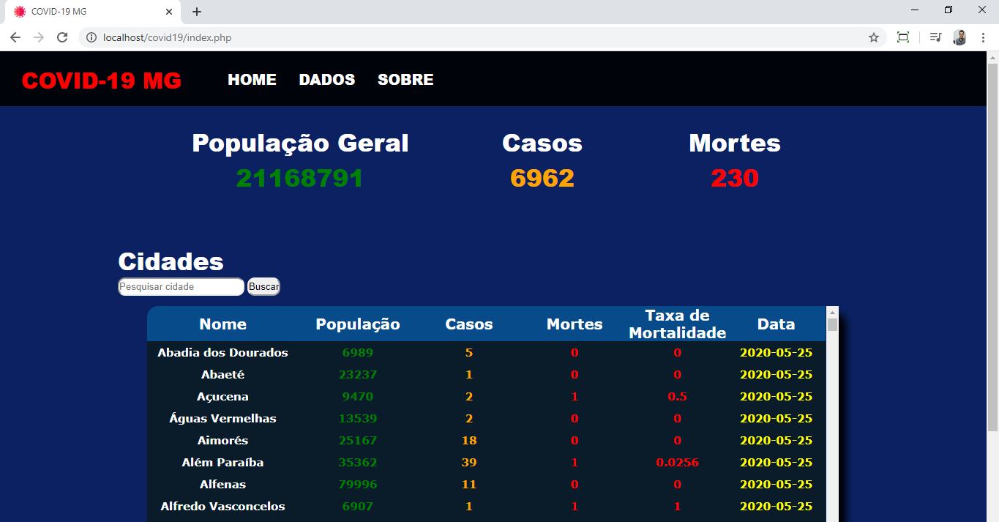

# Aplicação do banco de dados Redis com o PHP

Estes arquivos fazem referência à um trabalho sobre a implementação do banco de dados Redis na linguagem de programação PHP. O front-end não possui foco principal e por isso as páginas não apresentam o conteúdo de forma responsiva.

Os dados armazenados no Redis representam números do COVID-19 no estado de Minas Gerais, e são captados atráves de um arquivo .csv disponibilizado pelo site brasil.io.

<h2>Descrição dos arquivos:</h2>

<ul>
  <li>index.php (Página inicial em PHP com exibição dos dados); </li>
  <li>processamento/processamento.php (Coleta de dados do JSON e armazenamento no Redis); </li>
  <li>estilo/estilo.css (Arquivo de estilização CSS).</li>  
</ul>
  
  
<h2> Página </h2>

  

