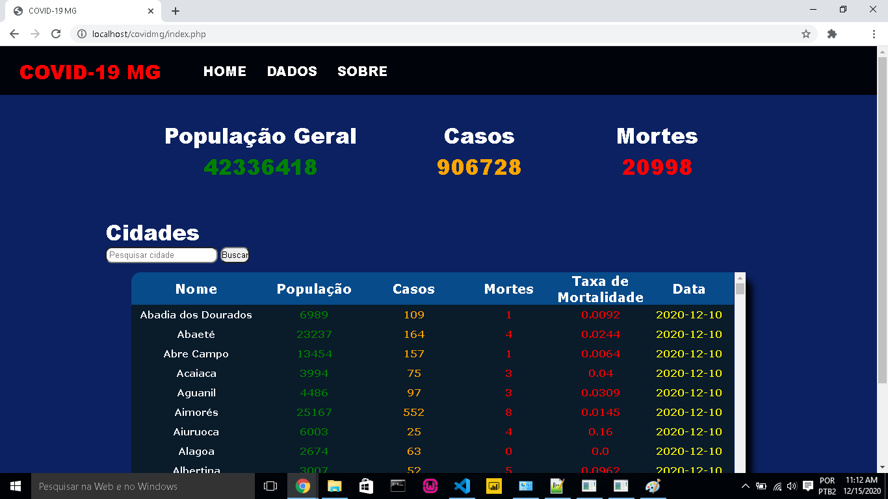

# Aplicação do banco de dados Redis em PHP

Estes arquivos fazem referência à um trabalho sobre a implementação do banco de dados Redis na linguagem de programação PHP. O front-end não possui foco principal e por isso as páginas não apresentam o conteúdo de forma responsiva.

Os dados armazenados no Redis representam números do COVID-19 em Minas Gerais, e são captados atráves de um arquivo .csv disponibilizado pelo site brasil.io.

<h2> Tecnologias utilizadas </h2>

- [Redis](https://redis.io/)
- [MySQL](https://www.mysql.com/)
- [PHP](https://www.php.net/)
- [HTML](https://developer.mozilla.org/pt-BR/docs/Web/HTML)
- [CSS](https://devdocs.io/css/)

<h2> Limpeza dos dados </h2>

O arquivo .csv completo contendo dados da covid-19 em todo o Brasil pode ser baixado diretamente na página <a href="https://brasil.io/dataset/covid19/caso_full/">Brasil.io</a>. Contudo, como o trabalho faz referência somente ao estado de Minas Gerais, é necessário realizar a limpeza dos dados. Para isso optou-se por utilizar o banco MySQL como ferramenta de auxílio.

```
CREATE DATABASE covidmg;
USE covidmg;

CREATE TABLE caso_full(
    city VARCHAR (45) NOT NULL,
    population INTEGER NOT NULL,
    confirmed INTEGER NOT NULL,
    deaths INTEGER NOT NULL,
    death_rate DOUBLE NOT NULL,
    last_date VARCHAR (45)
);
```
Após isso, codifica-se um script em PHP (ou na linguagem de preferência) para inserção dos dados de Minas Gerais no banco <b>covidmg</b>.
```
<?php

    $host = "localhost";
	$usuario = "root";
	$senha = "";
	$base = "covidmg";

	//conecta no banco de dados
	$conn = mysqli_connect($host, $usuario, $senha, $base);

	$delimitador = ',';

	// Abrir arquivo para leitura
	$f = fopen('caso_full.csv', 'r');
	$count = 0;
	$pgeral = 0;
	$casos = 0;
	$mortes = 0;
	
	$dataEscolhida = "2020-12-10";
	
	
	if ($f) { 

		// Ler cabecalho do arquivo
		$cabecalho = fgetcsv($f, 0, $delimitador);
		
	
		// Enquanto nao terminar o arquivo
		while (!feof($f)) { 

			// Ler uma linha do arquivo
			$linha = fgetcsv($f, 0, $delimitador);
			if (!$linha) {
				continue;
			}

			// Montar registro com valores indexados pelo cabecalho
			$registro = array_combine($cabecalho, $linha);

			// Obtendo dados para armazenamento no Redis
			
			if (strcmp($registro['state'],"MG") == 0 && strcmp($registro['date'],$dataEscolhida) == 0){
				
				$city = $registro['city'];
				$population = $registro['estimated_population_2019'];
				$confirmed = $registro['last_available_confirmed'];
				$deaths = $registro['last_available_deaths'];
				$death_rate = $registro['last_available_death_rate'];
				$date = $registro['date'];		
				
				$query = "INSERT INTO caso_full VALUES ('$city', '$population', '$confirmed', '$deaths', '$death_rate', '$date')";
				
				/*executa a query*/
				mysqli_query($conn, $query);
				
			}
		}
		fclose($f);
	}

?>

```
Em sequencia, exporta-se a consulta SQL referente a <b>caso_full</b>. 

```
SELECT * from caso_full;

```

<h2> Configuração do Redis </h2>

Para utilização do Redis com PHP é necessário realizar alguns passos de configuração, seja no Windows ou Linux. Para isso, recomenda-se a leitura dos seguintes artigos:

- [Sessões do PHP com Redis;](https://imasters.com.br/back-end/sessoes-php-com-redis)
- [Utilizando Redis com a extensão PHPRedis em sua aplicação PHP.](https://medium.com/@brenodouglas/utilizando-redis-com-a-extens%C3%A3o-phpredis-em-sua-aplica%C3%A7%C3%A3o-php-e81d4e2762fd)

<h2> Conexão Redis em PHP </h2>

```
<?php
	$host = 'localhost';
	$port = 6379;
	$redis = new Redis();
	if ($redis->connect($host, $port) == false){
	    die($redis->getLastError());
	}
	
	//as funções podem ser verificadas no arquivo <i>processamento.php</i>.
?>
```

<h2> Página </h2>


  

<h2> Contato </h2>

[](https://www.linkedin.com/in/otaviosilva22/)
[](mailto:otavio.ssilva22@gmail.com)

